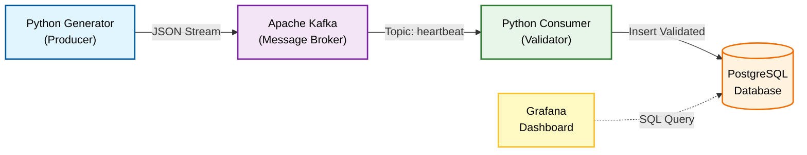
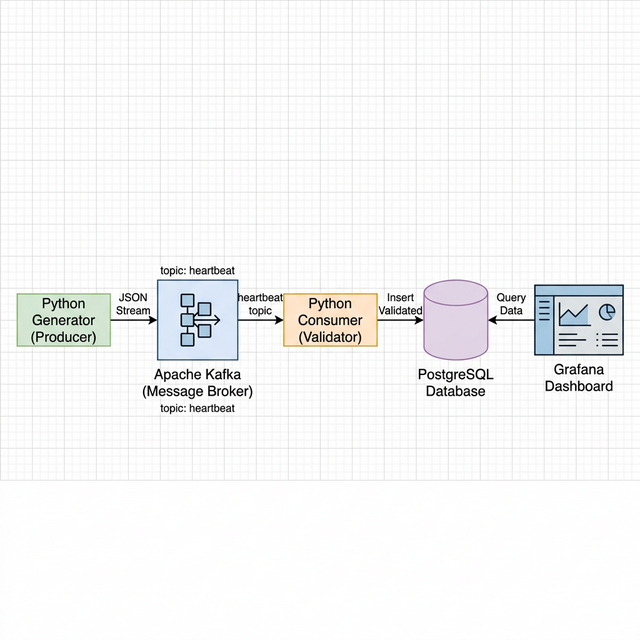
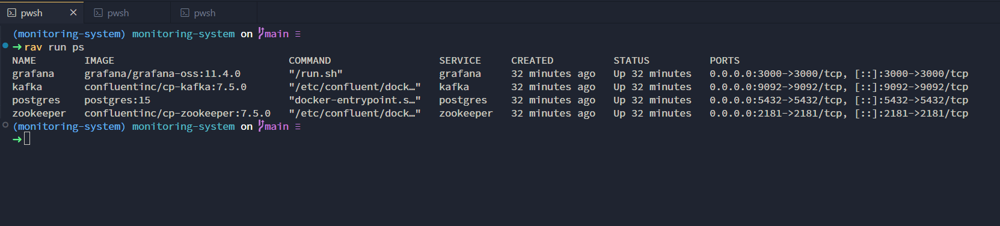
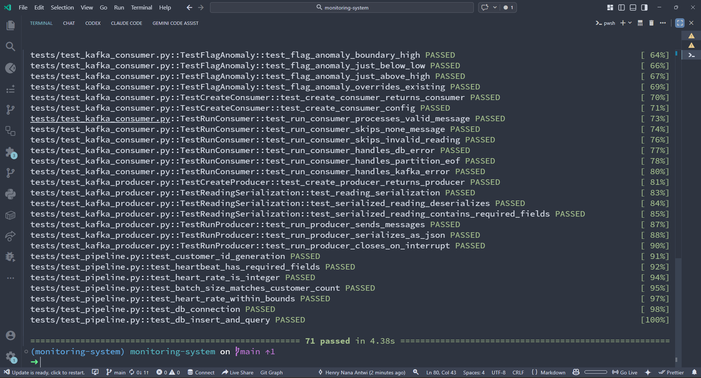
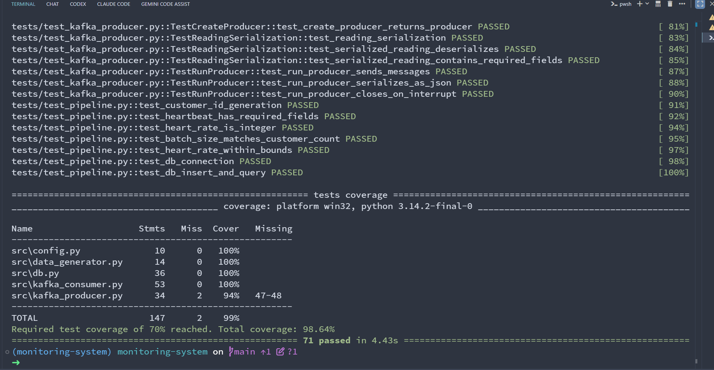
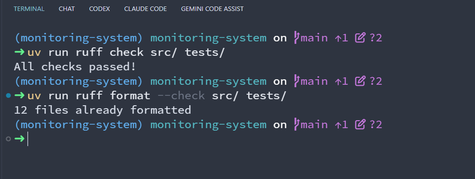
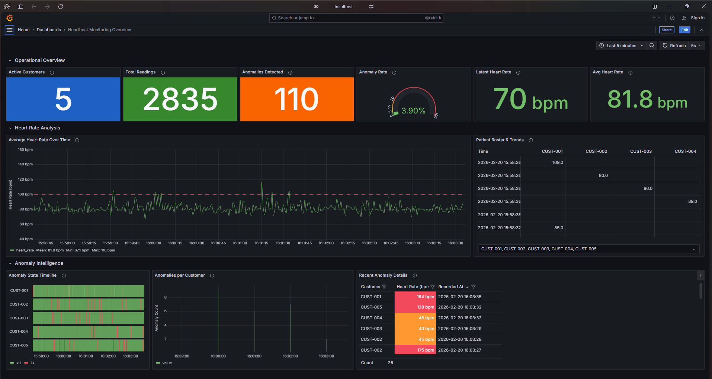
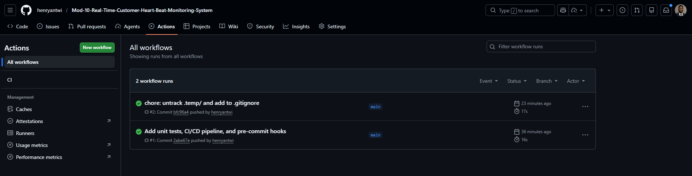

# Real-Time Customer Heartbeat Monitoring System

A data engineering pipeline that simulates heart rate monitors, streams readings through **Apache Kafka**, and stores them in **PostgreSQL**.

## Architecture



<!--  -->

## Prerequisites

- **Docker Desktop** (includes Docker Compose)
- **Python 3.10+**

## Quick Start

### 1. Start Infrastructure

```bash
docker-compose up -d
```

This starts **Zookeeper**, **Kafka**, **PostgreSQL**, and **Grafana**. The database schema is automatically created on first run.



### 2. Install Python Dependencies

```bash
pip install -r requirements.txt
```

### 3. Run the Producer (Terminal 1)

```bash
cd src
python kafka_producer.py
```

You should see messages being sent to Kafka.

### 4. Run the Consumer (Terminal 2)

```bash
cd src
python kafka_consumer.py
```

You should see messages being consumed, validated, and stored in PostgreSQL.

### 5. Run Tests

```bash
uv run pytest tests/ -v
```

<!-- 📸 INSERT SCREENSHOT: pytest test results showing all tests passing -->


To run with coverage:

```bash
uv run pytest tests/ --cov=src --cov-report=term-missing --cov-fail-under=70
```

<!-- 📸 INSERT SCREENSHOT: pytest coverage report showing coverage percentage -->


### 6. Lint & Format

```bash
uv run ruff check src/ tests/
uv run ruff format --check src/ tests/
```

<!-- 📸 INSERT SCREENSHOT: ruff check output (all checks passed) -->


### 7. Open the Grafana Dashboard

Grafana starts automatically with Docker Compose and is pre-configured with a **Heartbeat Monitor** dashboard.

1. Open **http://localhost:3000** in your browser
2. The dashboard loads automatically (no login required)
3. Panels auto-refresh every 5 seconds



## Project Structure

```
├── docker-compose.yml       # Kafka + Zookeeper + PostgreSQL + Grafana
├── requirements.txt         # Python dependencies
├── README.md                # This file
├── task.md                  # Assignment brief
│
├── sql/
│   └── schema.sql           # Database table definition
│
├── src/
│   ├── config.py            # Shared configuration
│   ├── data_generator.py    # Synthetic heartbeat generator
│   ├── kafka_producer.py    # Publishes data to Kafka
│   ├── kafka_consumer.py    # Reads from Kafka, writes to DB
│   └── db.py                # PostgreSQL connection & queries
│
├── tests/
│   ├── conftest.py            # Shared pytest fixtures
│   ├── test_config.py         # Config validation tests
│   ├── test_data_generator.py # Data generator tests
│   ├── test_db.py             # Database tests (mocked)
│   ├── test_kafka_consumer.py # Consumer tests (mocked)
│   ├── test_kafka_producer.py # Producer tests (mocked)
│   └── test_pipeline.py       # Component & integration tests
│
├── .github/
│   └── workflows/
│       └── ci.yml             # GitHub Actions CI pipeline
│
├── docs/
│   └── screenshots/         # Terminal & DB screenshots
│
├── grafana/
│   └── provisioning/
│       ├── datasources/
│       │   └── datasource.yml        # PostgreSQL connection config
│       └── dashboards/
│           ├── dashboard.yml         # Dashboard provider config
│           └── heartbeat-monitor.json # Pre-built dashboard
│
└── dashboard/
    └── app.py               # Legacy Streamlit dashboard (reference)
```

## Configuration

All settings are centralized in `src/config.py`:

| Setting | Default | Description |
|---------|---------|-------------|
| `KAFKA_BOOTSTRAP_SERVERS` | `localhost:9092` | Kafka broker address |
| `KAFKA_TOPIC` | `heartbeat-readings` | Topic name |
| `DB_CONFIG` | See file | PostgreSQL connection details |
| `NUM_CUSTOMERS` | `5` | Simulated customer count |
| `SEND_INTERVAL_SECONDS` | `1` | Delay between batches |
| `ANOMALY_CHANCE` | `0.05` | Probability of anomaly reading |

## CI/CD

This project uses **GitHub Actions** for continuous integration. On every push to `main` and on pull requests, the pipeline runs:

1. **Ruff lint** — code quality checks
2. **Ruff format** — formatting verification
3. **Pytest** — full test suite with 70% coverage gate

<!-- 📸 INSERT SCREENSHOT: GitHub Actions CI workflow passing -->


## Stopping the System

```bash
# Stop producer/consumer with Ctrl+C in their terminals

# Stop Docker containers
docker-compose down

# Stop and remove data volumes
docker-compose down -v
```
